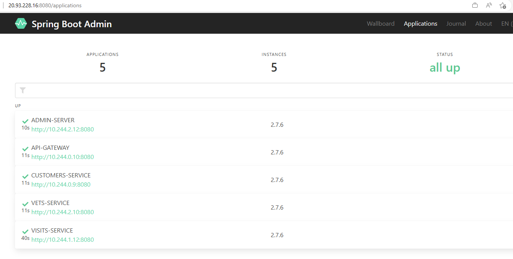
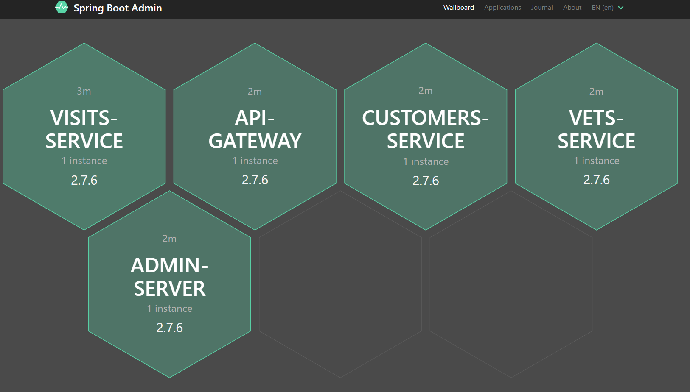
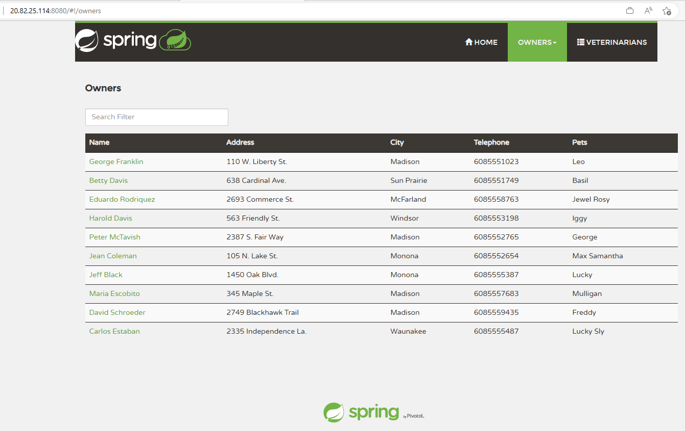

# Test the application through the publicly available endpoint

Now that you have deployed each of the microservices, you will test them out to see if they were deployed correctly. Also inspect wether all pods are properly up and running. In case they are not, inspect the logs to figure out what might be missing.

- [Get public endpoints](https://docs.microsoft.com/en-us/azure/aks/kubernetes-walkthrough#test-the-application)

## Step by step guidance

1. You configured both the _api-gateway_ and the _admin-server_ with a loadbalancer. Double check whether public IP's were created for them.

   ```bash
   kubectl get services -n spring-petclinic
   ```

   This should output info similar to this.

   ```bash
   NAME                             TYPE           CLUSTER-IP     EXTERNAL-IP     PORT(S)          AGE
   admin-server                     LoadBalancer   10.0.73.174    20.245.56.122   8080:32737/TCP   160m
   api-gateway                      LoadBalancer   10.0.165.209   20.245.56.35    8080:30278/TCP   157m
   config-server                    ClusterIP      10.0.233.72    <none>          8888/TCP         163m
   customers-service                ClusterIP      10.0.30.192    <none>          8080/TCP         171m
   discovery-server                 ClusterIP      10.0.184.95    <none>          8761/TCP         162m
   vets-service                     ClusterIP      10.0.94.74     <none>          8080/TCP         171m
   visits-service                   ClusterIP      10.0.84.138    <none>          8080/TCP         170m
   ```

   Both the admin-server and the api-gateway should have an external IP.

   {: .note }
   > You can also take a look in the _MC_ resource group in the Azure portal. You will notice 2 Public IP addresses got created.

1. Copy the external IP of the _admin-server_ and use a browser window to connect to port _8080_. This will show you info about each of your applications.

   

1. Select _Wallboard_ and next one of your microservices. The Admin server will show you internal info of your services.

   

1. Copy the external IP of the _api-gateway_ and use a browser window to connect to port _8080_. It should show you information on the pets and visits coming from your database.

   

   You now have the Spring Petclinic application running properly on the AKS cluster.

1. In case you are not seeing any data in your application, you can troubleshoot this issue by interactively connecting to your MySQL Felxible Server and querying your databases and tables.

   ```bash
   az mysql flexible-server connect -n $MYSQL_SERVER_NAME -u myadmin -p $MYSQL_ADMIN_PASSWORD --interactive
   show databases;
   use petclinic;
   show tables;
   select * from owners;
   ```

   {: .note }
   > For the MySQL Flexible Server connection to work, you will need to have your local IP address added to the MySQL Flexible Server firewall.

   {: .note }
   > Once you got everything up and running, you are now probably very eager to push your code changed to a GitHub repository. Be mindful though when you do this: **Do not push your GitHub PAT token** (it's in the local `application.yml` file of the config-server) to a remote repository. It will immediately invalidate the PAT token and your config-server will start failing. You should exclude the `application.yml` file from your commit. You can also check out the [LabTips]() on how to recover from this in case you did accidentally push the PAT token to your remote repo.
