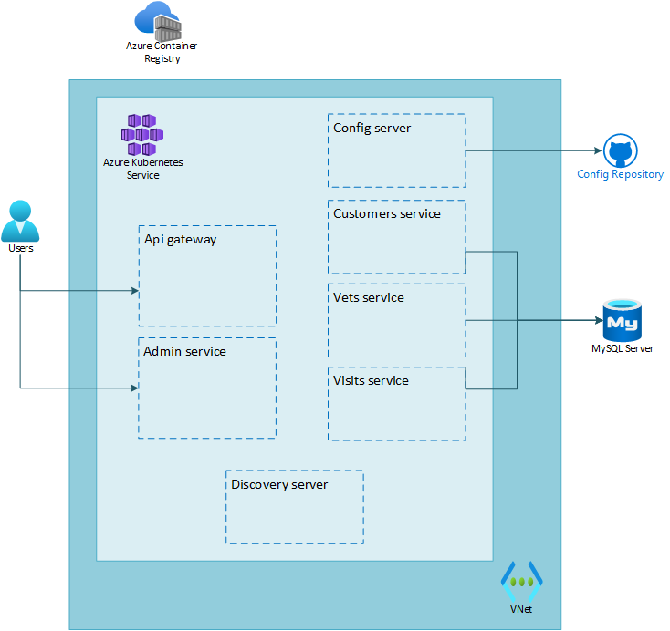

# Lab 02: Migrate a Spring Apps microservices application to Azure Kubernetes Service

# Student manual

## Lab scenario

You have established a plan for migrating the Spring Petclinic application to Azure Kubernetes Service. It is now time to perform the actual migration of the Spring Petclinic application components.

## Objectives

After you complete this lab, you will be able to:

- Create an AKS service and Container Registry.
- Set up a configuration repository.
- Create an Azure MySQL Database service.
- Create container images and push them to Azure Container Registry.
- Deploy the microservices of the Spring Petclinic app to the AKS cluster.
- Test the application through the publicly available endpoint.

The below image illustrates the end state you will be building in this lab.

## Lab Duration

- **Estimated Time**: 120 minutes

## Instructions

During the process you'll:

- Create an AKS service and Container Registry.
- Set up a configuration repository.
- Create an Azure MySQL Database service.
- Create container images and push them to Azure Container Registry.
- Deploy the microservices of the Spring Petclinic app to the AKS cluster.
- Test the application through the publicly available endpoint.

{: .note }
> The Azure-Samples/java-microservices-aks-lab repository contains a dev container for Java development. This container contains all the needed tools for running this lab. In case you want to use this dev container you can either use a [GitHub CodeSpace](https://github.com/features/codespaces) in case your GitHub account is enabled for Codespaces. Or you can use the [Visual Studio Code Remote Containers option](https://code.visualstudio.com/docs/remote/containers). You can find all steps to get this set up in the [installation instructions]().
