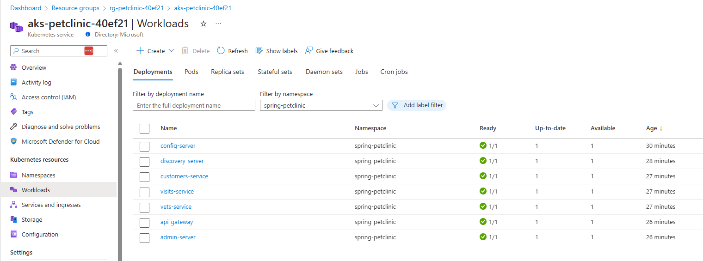
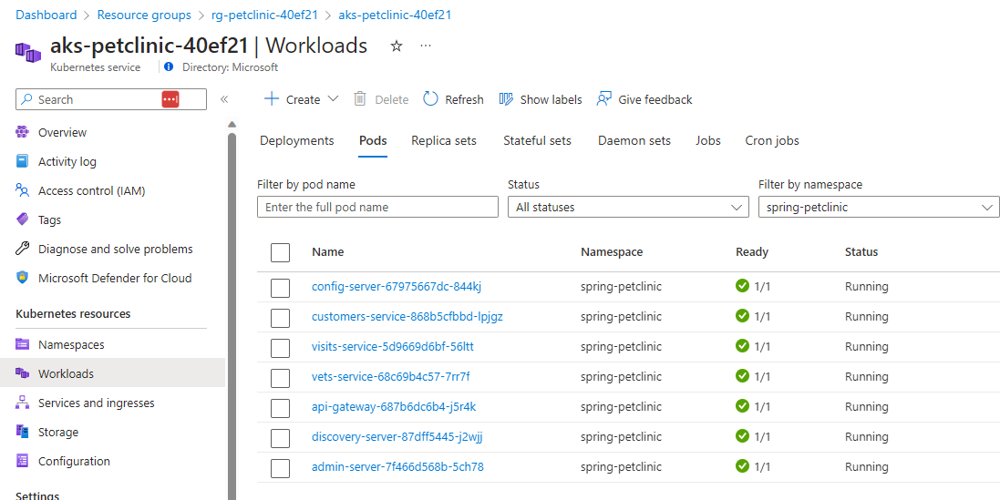
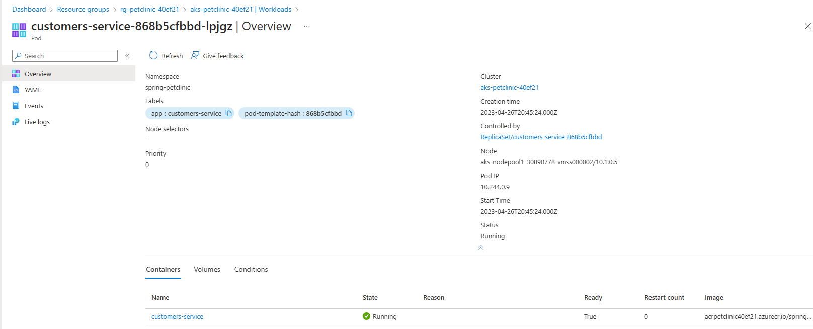
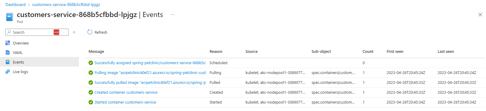
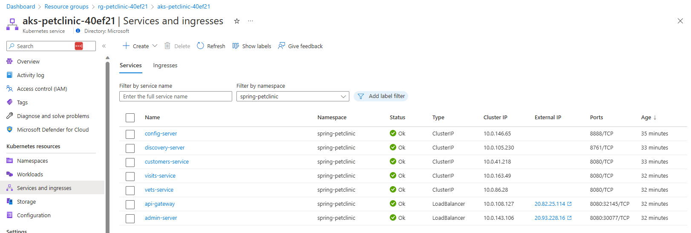
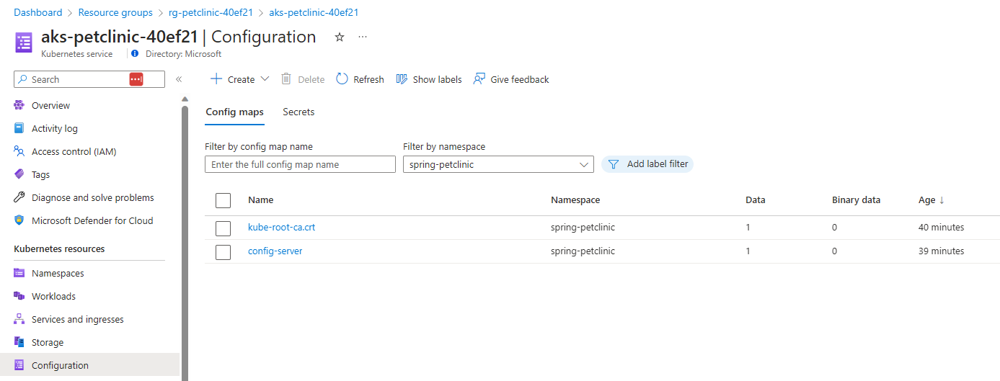

# Inspect your AKS service in the Azure Portal

By default the Azure Portal already gives you quite some info on the current status of the resources running in your AKS instance. In this first step of this lab, open the Azure Portal, navigate to your AKS instance and inspect what info you can find on the kubernetes resources running in the cluster. Find information on:

- The pods running in the `spring-petclinic` namespace.
- The services and ingresses running in the `spring-petclinic` namespace.
- The config maps in the `spring-petclinic` namespace.
- The deployments in the `spring-petclinic` namespace.
- The AKS node your `customers-service` is running on.
- The live logs of the `customers-service`.

You can follow the below guidance to do so.

- [Access Kubernetes resources from the Azure portal](https://learn.microsoft.com/azure/aks/kubernetes-portal?tabs=azure-cli)

You will notice that a lot of the data you see here is the same info you can get by issuing `kubectl get` statements. What `kubectl` statements would you issue for getting the same info?

## Step by step guidance

1. In your browser navigate to the Azure Portal, and to the resource group you deployed the AKS cluster to. Select the AKS cluster.

1. In the menu under `Kubernetes resources`, select `Workloads`. Select the `spring-petclinic` namespace. You will see all the deployments in this namespace.

   

1. Select the `Pods` tab and filter by the `spring-petclinic` namespace here as well. You will now see all pods running in your AKS cluster in the `spring-petclinic` namespace.

   

1. Select the `customers-service` pod to see its details. In the detail overview, you will see which node this pod is running on.

   

1. Select the `Events` in the menu. The events for the pod will now be shown.

   

1. Navigate back to the AKS cluster and select `Services and ingresses` from the menu. Select the `spring-petclinic` namespace. This will show all the ClusterIP and LoadBalancer types you created.

   

1. Select `Configuration` and filter by the `spring-petclinic` namespace here as well. This will show you the config maps in this namespace.

   

1. When using `kubectl` statements, the equivalent statements for getting the same info as in the portal are:

   ```bash
   kubectl get pods -n spring-petclinic
   kubectl get services -n spring-petclinic
   kubectl get configmap -n spring-petclinic
   kubectl get deployments -n spring-petclinic
   kubectl describe pod <customers-service-pod-instance> -n spring-petclinic
   kubectl logs <customers-service-pod-instance> -n spring-petclinic
   ```
