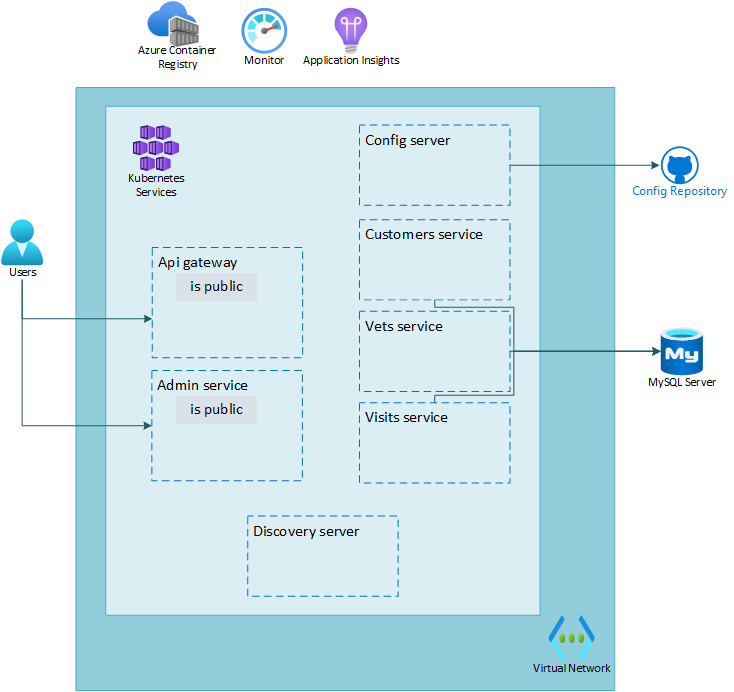

# Lab 03: Enable monitoring and end-to-end tracing

# Student manual

## Lab scenario

You have created your first Azure Kubernetes Service, deployed your applications to it and exposed them through the api-gateway service. Now that everything is up and running, it would be nice to monitor the availability of your applications and to be able to see in case any errors or exceptions in your applications occur. In this lab you will add end-to-end monitoring to your applications.

## Objectives

After you complete this lab, you will be able to:

- Inspect your AKS service in the Azure Portal
- Configure AKS monitoring
- Configure Application Insights to receive monitoring information from your applications
- Analyze application specific monitoring data
- Analyze logs

The below image illustrates the end state you will be building in this lab.

## Lab Duration

- **Estimated Time**: 60 minutes

## Instructions

In this lab, you will:

- Inspect your AKS service in the Azure Portal
- Configure AKS monitoring
- Configure Application Insights to receive monitoring information from your applications
- Analyze application specific monitoring data
- Analyze logs

{: .note }
> The instructions provided in this exercise assume that you successfully completed the previous exercise and are using the same lab environment, including your Git Bash session with the relevant environment variables already set.
