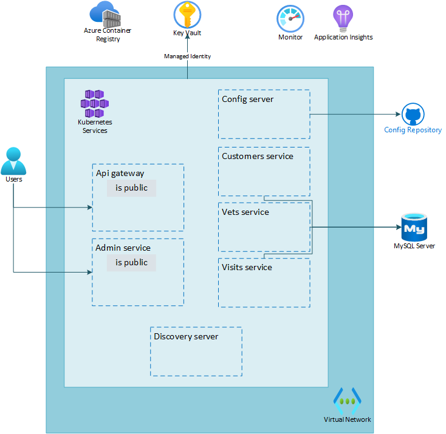

# Lab 04: Secure application secrets using Key Vault

# Student manual

## Lab scenario

Your team is now running a first version of the spring-petclinic microservice application in Azure. However you don't like the fact that your application secrets live directly in configuration code. Also the GitHub config repo you have, has been reporting to you that it holds secret values. You would like to have a better way to protect application secrets like your database connection string and your GitHub PAT token. In this lab you will better protect your application secrets.

## Objectives

After you complete this lab, you will be able to:

- Create an Azure Key Vault service
- Add your connection string and GitHub PAT as a secret in Key Vault
- Add Key Vault CSI driver to your cluster
- Allow your kubelet identity access to your Key Vault
- Create a secret provider class to serve secrets from Key Vault to your application

The below image illustrates the end state you will be building in this lab.

## Lab Duration

- **Estimated Time**: 60 minutes

## Instructions

During this lab, you will:

- Create an Azure Key Vault service
- Add your GitHub PAT as a secret in Key Vault
- Add Key Vault CSI driver to your cluster
- Create a secret provider class to serve secrets from Key Vault to your application
- Connect to the database without using username and password

{: .note }
> The instructions provided in this exercise assume that you successfully completed the previous exercise and are using the same lab environment, including your Git Bash session with the relevant environment variables already set.

