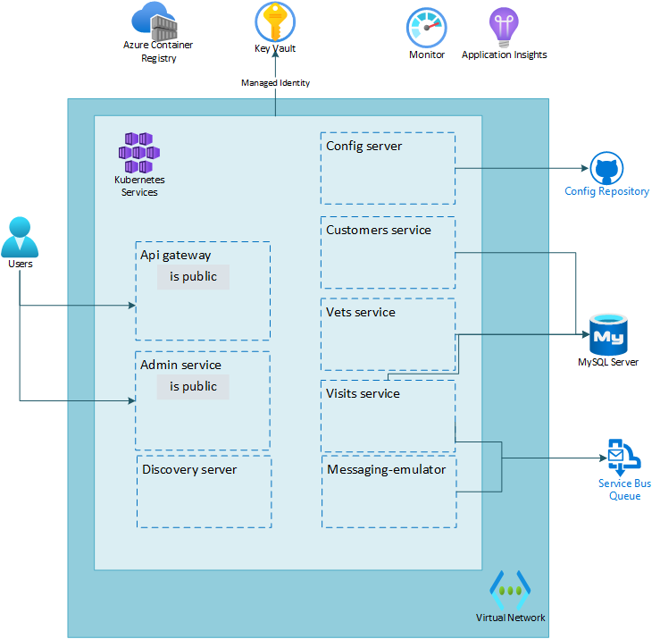

# Lab 05: Create and configure Azure Service Bus for sending messages between microservices

# Student manual

## Lab scenario

You have now set up and deployed the Spring Petclinic application. Some of the microservices however also need to send messages to a third party system over a message bus and you also want to enable the intake of telemetry events. You want to provide this functionality with native Azure services like Azure Service Bus and Azure Event Hub. In a first step you will provide the messaging behavior.

## Objectives

After you complete this lab, you will be able to:

- Create an Azure Service Bus resource
- Try out an existing microservice
- Update an existing microservice to use the queues
- Add the message producer

The below image illustrates the end state you will be building in this lab.

## Lab Duration

- **Estimated Time**: 60 minutes

## Instructions

During this lab, you will:

- Create an Azure Service Bus resource
- Try out an existing microservice
- Update an existing microservice to use the queues
- Add the message producer

{: .note }
> The instructions provided in this exercise assume that you successfully completed the previous exercise and are using the same lab environment, including your Git Bash session with the relevant environment variables already set.
