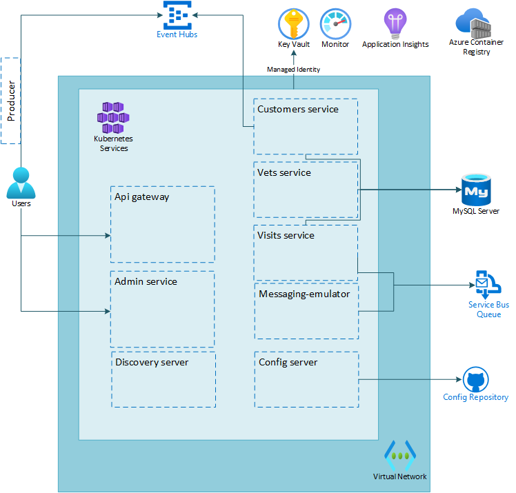

# Lab 06: Create and configure Azure Event Hubs for sending events between microservices

# Student manual

## Lab scenario

You have now set up messaging for the Spring Petclinic application. As a next step you will set up the receiving of events from an Azure Event Hub.

## Objectives

After you complete this lab, you will be able to:

- Create an Azure Event Hub resource
- Update an existing microservice to send events to the Event Hub
- Update an existing microservice to receive events from the Event Hub
- Inspect telemetry data being received

The below image illustrates the end state you will be building in this lab.

## Lab Duration

- **Estimated Time**: 60 minutes

## Instructions

During this lab, you will:

- Create an Azure Event Hub resource
- Use an existing microservice to send events to the Event Hub
- Update an existing microservice to receive events from the Event Hub
- Inspect telemetry data being received

{: .note }
> The instructions provided in this exercise assume that you successfully completed the previous exercise and are using the same lab environment, including your Git Bash session with the relevant environment variables already set.
