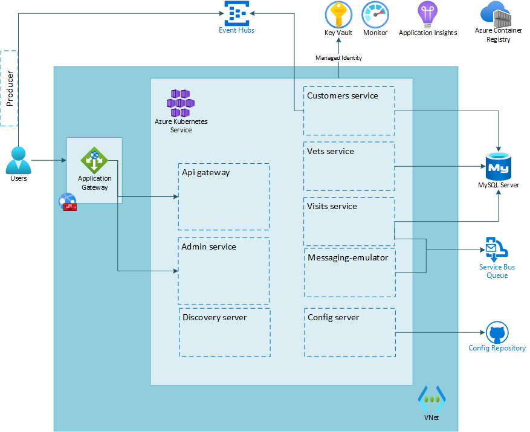

# Lab 07: Protect endpoints using Web Application Firewall

# Student manual

## Lab scenario

By now, you have completed setting up your Spring Boot application in Azure on AKS and secured the secrets used by the microservices to connect to their data store. You are satisfied with the results, but you do recognize that there is still room for improvement. In particular, you are concerned with the public endpoints of the application which are directly accessible to anyone with access to the internet. You would like to add a Web Application Firewall to filter incoming requests to your application. In this exercise, you will step through implementing this configuration.

## Objectives

After you complete this lab, you will be able to:

- Update your microservices to use an internal loadbalancer
- Create additional networking resources
- Acquire a certificate and add it to Key Vault
- Create the Application Gateway resources
- Access the application by DNS name
- Expose the admin server
- Configure WAF on Application Gateway

The below image illustrates the end state you will be building in this lab.

## Lab Duration

- **Estimated Time**: 60 minutes

## Instructions

During this lab, you will:

- Update your microservices to use an internal loadbalancer
- Create additional networking resources
- Acquire a certificate and add it to Key Vault
- Create the Application Gateway resources
- Access the application by DNS name
- Expose the admin server
- Configure WAF on Application Gateway

{: .note }
> The instructions provided in this exercise assume that you successfully completed the previous exercise and are using the same lab environment, including your Git Bash session with the relevant environment variables already set.
