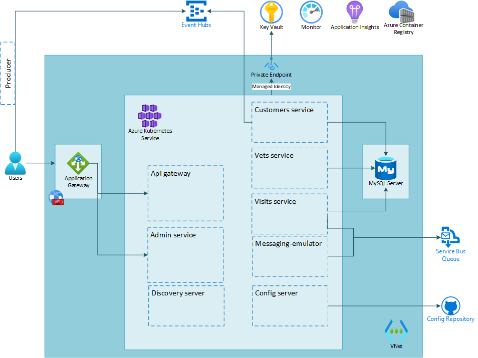

# Review

In this lab, you implemented a configuration in which PaaS services used by Azure Spring Apps applications accept only connections that originate from within the virtual network hosting these apps. In this lab you

- Locked down the Azure Database for MySQL Flexible Server instance by redeploying it in a subnet
- Locked down the Key Vault instance by using a private endpoint
- Tested your setup

The below image illustrates the end state you have build in this lab.

